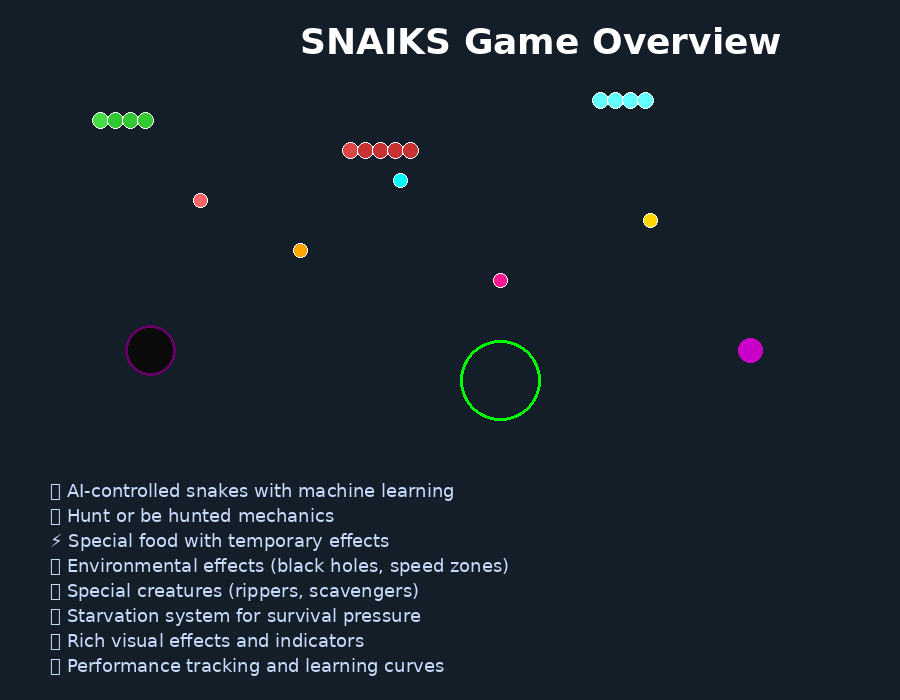
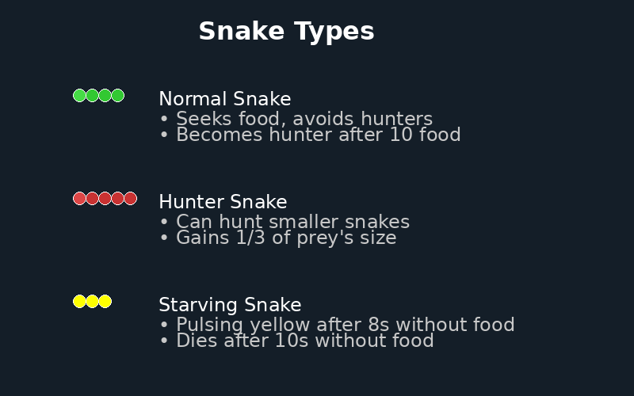
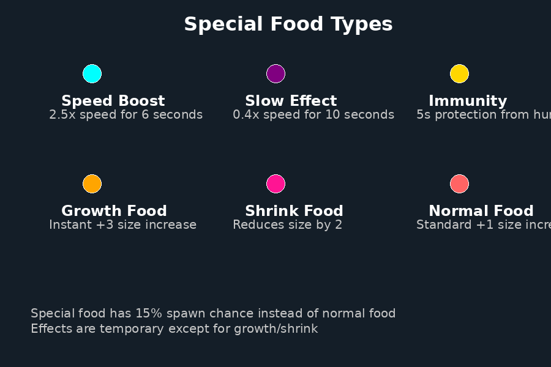
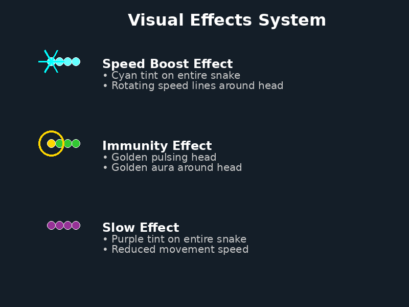
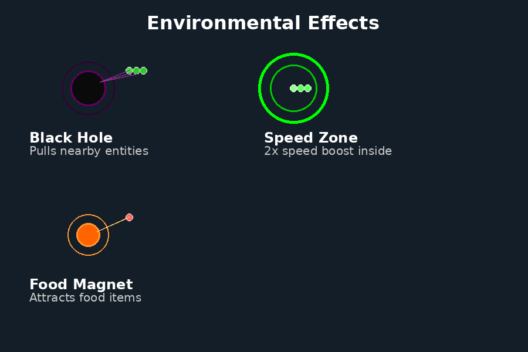
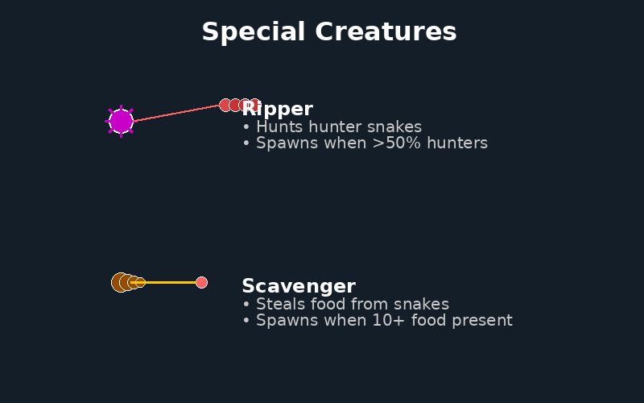
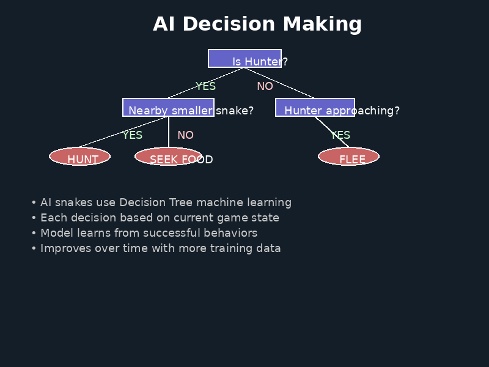
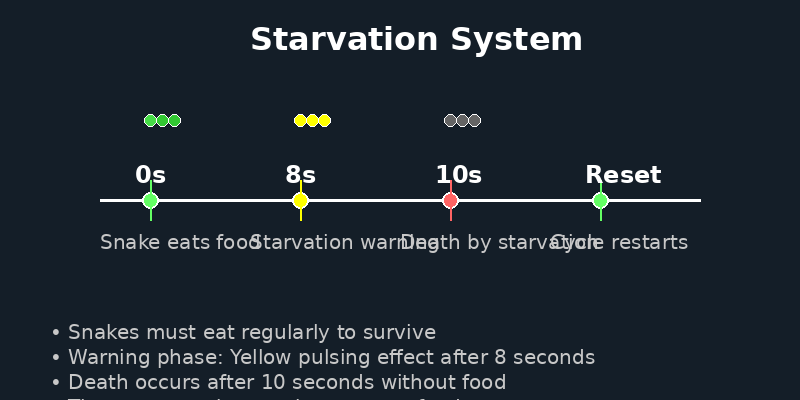
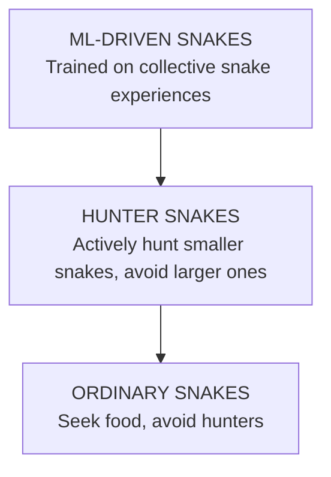

# SNAIKS
```

                      /$$$$$$  /$$$$$$ /$$                
                     /$$__  $$|_  $$_/| $$                
  /$$$$$$$ /$$$$$$$ | $$  \ $$  | $$  | $$   /$$  /$$$$$$$
 /$$_____/| $$__  $$| $$$$$$$$  | $$  | $$  /$$/ /$$_____/
|  $$$$$$ | $$  \ $$| $$__  $$  | $$  | $$$$$$/ |  $$$$$$ 
 \____  $$| $$  | $$| $$  | $$  | $$  | $$_  $$  \____  $$
 /$$$$$$$/| $$  | $$| $$  | $$ /$$$$$$| $$ \  $$ /$$$$$$$/
|_______/ |__/  |__/|__/  |__/|______/|__/  \__/|_______/ 
                                                          
        
```



## Project Overview

**Snaiks** is an advanced Python-based Snake Battle Royale simulation featuring multiple AI-controlled snakes competing for survival in a dynamic, effects-rich environment. This project demonstrates sophisticated machine learning techniques, complex multi-agent systems, and emergent gameplay behaviors.

The simulation includes:
- **AI-driven snakes** using Decision Tree machine learning
- **Special food system** with temporary effects and visual indicators
- **Environmental hazards** like black holes and speed zones
- **Dynamic creature ecology** with rippers and scavengers
- **Starvation mechanics** for survival pressure
- **Rich visual effects** showing active snake states

## Learning Objectives

- Demonstrate reinforcement learning in competitive multi-agent environments
- Visualize emergent AI behaviors through dynamic gameplay
- Create complex ecosystems where strategies evolve organically
- Showcase advanced game mechanics with visual feedback systems
- Provide accessible examples of ML applied to interactive simulations

---

## 🐍 Snake Types & Behaviors



### Normal Snakes
- **Appearance**: Green body with lighter green head
- **Behavior**: Seek food, avoid hunters and environmental hazards
- **Goal**: Consume 10 food items to evolve into hunters
- **AI Strategy**: Focus on food acquisition while maintaining safe distances from threats

### Hunter Snakes  
- **Appearance**: Red body with lighter red head
- **Behavior**: Can hunt and consume smaller snakes
- **Growth**: Gain 1/3 of consumed prey's size
- **AI Strategy**: Balance hunting opportunities with threat avoidance
- **Trigger**: Automatically activate when reaching 10+ food consumed

### Starving Snakes
- **Visual Effect**: Pulsing yellow/orange coloration
- **Warning Phase**: Begins after 8 seconds without food
- **Death**: Occurs after 10 seconds without food consumption
- **Behavior**: Increasingly desperate food-seeking with reduced caution

---

## 🎯 Special Food System



The game features a sophisticated special food system with a 15% spawn chance for enhanced food items:

### Speed Boost Food
- **Color**: Cyan/Turquoise
- **Effect**: 2.5x movement speed and 3x acceleration
- **Duration**: 6 seconds
- **Strategic Value**: Escape predators or catch prey

### Slow Food
- **Color**: Purple  
- **Effect**: 0.4x movement speed reduction
- **Duration**: 10 seconds
- **Strategic Impact**: Vulnerability window, requires careful positioning

### Immunity Food
- **Color**: Gold
- **Effect**: Complete protection from hunter attacks
- **Duration**: 5 seconds
- **Tactical Use**: Safe passage through dangerous areas

### Growth Food
- **Color**: Orange
- **Effect**: Instant +3 size increase
- **Duration**: Permanent
- **Advantage**: Immediate size boost without hunting risk

### Shrink Food
- **Color**: Deep Pink
- **Effect**: Reduces size by 2 segments
- **Minimum**: Won't shrink below 2 segments
- **Strategic Risk**: Can make snakes vulnerable but increases agility

---

## ✨ Visual Effects System



The game features comprehensive visual feedback for all active effects:

### Speed Boost Effects
- **Body Tint**: Cyan coloration across entire snake
- **Head Effect**: Bright cyan pulsing head
- **Particle Effect**: Rotating speed lines around head
- **Animation**: Lines rotate continuously while effect is active

### Immunity Effects  
- **Head Color**: Golden pulsing head with variable intensity
- **Aura Effect**: Golden ring pulsing around snake head
- **Protection Visual**: Clear indication of invulnerability status
- **Flash Rate**: Configurable pulsing speed (8 Hz default)

### Slow Effects
- **Body Tint**: Purple coloration indicating reduced speed
- **Head Color**: Purple head matching body effect
- **Movement**: Visibly slower, stuttered movement patterns
- **Duration Display**: Effect persists for full 10-second duration

### Starvation Warning
- **Color Shift**: Yellow pulsing for normal snakes, orange for hunters
- **Intensity**: Increases as starvation progresses
- **Frequency**: Fast pulsing (8 Hz) to indicate urgency
- **Timing**: Activates at 8 seconds, death at 10 seconds

---

## 🌍 Environmental Effects



### Black Holes
- **Visual**: Dark center with purple swirling border
- **Effect**: Gravitational pull on all nearby entities
- **Pull Radius**: 120 pixels from center
- **Pull Strength**: 1.5x acceleration toward center
- **Lifetime**: 15 seconds before disappearing
- **Spawn Rate**: Every 20 seconds (maximum 2 active)

### Speed Zones
- **Appearance**: Green circular zones with pulsing borders
- **Fast Zones**: 2.0x speed multiplier inside zone
- **Slow Zones**: 0.3x speed multiplier (rare spawn)
- **Zone Radius**: 80 pixels effective area
- **Duration**: 20 seconds active lifetime
- **Spawn Rate**: Every 25 seconds (maximum 3 active)

### Food Magnets
- **Visual**: Orange center with radiating attraction lines
- **Effect**: Pulls food items toward center
- **Pull Radius**: 100 pixels for food attraction
- **Pull Strength**: 2.0x acceleration on food items
- **Lifetime**: 12 seconds before expiring
- **Spawn Rate**: Every 30 seconds (maximum 1 active)

---

## 👾 Special Creatures



### Ripper Entities
- **Appearance**: Purple spiky creature with radiating spikes
- **Target**: Hunts hunter snakes exclusively
- **Spawn Condition**: >50% of snakes are hunters
- **Behavior**: Aggressively pursues nearest hunter
- **Population Control**: Naturally balances hunter/normal snake ratio
- **Despawn**: Automatically removes when hunter population drops

### Scavenger Entities  
- **Appearance**: Brown segmented creature
- **Behavior**: Steals food items from the environment
- **Spawn Condition**: 10+ food items present on screen
- **Effect**: Reduces food availability, increases competition
- **Strategy Impact**: Forces more aggressive food-seeking behavior
- **Resource Competition**: Competes directly with snakes for food

---

## 🧠 AI Decision Making



### Machine Learning Model
Snakes use **Decision Tree Classifiers** trained on gameplay data to make intelligent movement decisions.

### Input Features
| Feature | Description |
|---------|-------------|
| Current Direction | Snake's movement vector (x,y) |
| Food Distance/Direction | Vector to nearest food item |
| Wall Distances | Distance to each screen boundary |
| Self-Collision Risk | Distance to own body segments |
| Hunter Proximity | Distance and direction to nearest hunter |
| Size Comparison | Relative size vs nearby threats/prey |
| Environmental Effects | Active zone effects and hazards |

### Decision Tree Logic
```
IF is_hunter AND nearby_smaller_snake AND no_larger_threats:
    → HUNT (pursue smaller snake)
ELIF is_hunter AND nearby_smaller_snake BUT larger_threat_approaching:
    → EVALUATE_RISK (weigh hunting vs fleeing)
ELIF hunter_approaching AND size_difference > fear_margin:
    → FLEE (escape from larger predator)
ELSE:
    → SEEK_FOOD (standard food acquisition)
```

### Learning Process
1. **Data Collection**: Every snake decision generates training samples
2. **Model Training**: Decision trees learn from successful survival strategies
3. **Behavior Evolution**: AI improves over multiple training sessions
4. **Performance Metrics**: Track accuracy, survival time, and size growth

---

## ⏰ Starvation System



### Survival Mechanics
The starvation system creates constant survival pressure, forcing active food-seeking behavior:

### Timeline Progression
- **0-8 seconds**: Normal operation after eating food
- **8-10 seconds**: Starvation warning with visual effects
- **10+ seconds**: Death by starvation

### Visual Indicators
- **Warning Phase**: Yellow pulsing (normal snakes) or orange pulsing (hunters)
- **Intensity**: Pulsing frequency increases as death approaches
- **Reset Trigger**: Any food consumption resets the starvation timer

### Strategic Impact
- **Forces Activity**: Snakes cannot remain stationary
- **Risk vs Reward**: Must venture into dangerous areas for food
- **Population Control**: Natural removal of inactive or ineffective snakes
- **AI Learning**: Teaches importance of consistent food acquisition

---

## 🎮 Game Mechanics Deep Dive

### Growth & Evolution System
- **Normal Growth**: +1 size per food item consumed
- **Hunter Transformation**: Automatic at 10 food items
- **Predation Growth**: +33% of prey's size when hunting
- **Size Penalties**: Larger snakes move slower (configurable)

### Movement Physics
- **Acceleration Based**: Gradual speed changes, not instant
- **Size Impact**: Movement speed decreases with size
- **Effect Modifiers**: Special food can temporarily override speed limits
- **Environmental**: Zones can boost or reduce movement capabilities

### Collision Detection
- **Snake vs Snake**: Hunters can consume smaller snakes
- **Snake vs Food**: Triggers growth and effect application
- **Snake vs Environment**: Interaction with effects and boundaries
- **Immunity System**: Temporary protection from hunter attacks

### AI Behavioral Patterns
Through machine learning, snakes develop complex strategies:

1. **Opportunistic Hunting**: Hunters learn optimal pursuit timing
2. **Threat Assessment**: Dynamic evaluation of nearby dangers  
3. **Resource Competition**: Efficient food acquisition patterns
4. **Environmental Awareness**: Learning to use effects strategically
5. **Survival Optimization**: Balancing growth vs safety

---

## 📊 Performance & Training

### Training Mechanics
```python
# Training data format per decision:
[direction_x, direction_y, food_distance_x, food_distance_y, 
 wall_distance_up, wall_distance_right, wall_distance_down, wall_distance_left,
 self_collision_distance, hunter_distance, hunter_vec_x, hunter_vec_y, 
 environmental_effects, food_effects, action_taken]
```

### Learning Cycle
1. **Gameplay**: Snakes make decisions using current model + exploration
2. **Data Recording**: Every decision and outcome logged
3. **Model Training**: Batch training on accumulated experience  
4. **Performance Evaluation**: Cross-validation and accuracy metrics
5. **Deployment**: Updated models used in subsequent games

### Success Metrics
- **Survival Time**: Average lifespan across game sessions
- **Size Achievement**: Maximum size reached before death
- **Hunt Success Rate**: Percentage of successful predation attempts
- **Food Efficiency**: Food items consumed per unit time
- **Model Accuracy**: Prediction accuracy on validation data

---

## 🚀 Setup & Usage

### Prerequisites
```bash
pip install pygame numpy pandas scikit-learn matplotlib pillow
```

### Quick Start
```bash
# Start the simulation to generate training data
python main.py

# Train the AI model on collected gameplay data  
python train_model.py

# Run enhanced simulation with trained AI
python main.py
```

### Configuration
Modify `settings.py` to customize:
- **Special Food**: Enable/disable types and adjust spawn rates
- **Environmental Effects**: Control effect frequency and intensity  
- **Creature Population**: Adjust spawn thresholds and maximums
- **AI Parameters**: Tune learning rates and exploration factors
- **Visual Effects**: Customize colors, animations, and indicators

### Training Data Management
- **Models**: Saved in `/models` directory with timestamps
- **Metrics**: Performance data tracked in `/metrics`  
- **Visualizations**: Learning curves generated in `/plots`
- **Data Export**: CSV format for external analysis

---

## 🔧 Advanced Features

### Modular Architecture
- **Effects System**: Pluggable environmental effects
- **Creature Manager**: Dynamic entity spawning and management
- **Food Factory**: Configurable special food creation
- **Visual Effects**: Layered rendering with particle systems
- **AI Framework**: Swappable machine learning models

### Performance Optimization
- **Resource Manager**: Memory and computation tracking
- **Spatial Partitioning**: Efficient collision detection
- **Effect Pooling**: Reusable visual effect objects
- **Batched Operations**: Optimized update cycles

### Extensibility
- **Custom Creatures**: Easy addition of new entity types
- **Effect Plugins**: Modular environmental effect system
- **AI Models**: Support for different learning algorithms
- **Visual Themes**: Customizable appearance systems

---

## 📈 Analysis & Insights

### Emergent Behaviors
Over extended training sessions, observe:
- **Pack Hunting**: Coordinated hunter strategies
- **Defensive Formations**: Protective normal snake behaviors  
- **Resource Territory**: Area control around food sources
- **Effect Exploitation**: Strategic use of environmental zones
- **Risk Calibration**: Optimal danger vs reward calculations

### Research Applications
This simulation provides insights into:
- **Multi-agent Learning**: Competitive AI development
- **Emergent Complexity**: Simple rules creating complex behaviors
- **Ecosystem Dynamics**: Predator-prey population balancing
- **Behavioral Evolution**: Strategy development over time
- **Environmental Adaptation**: Response to changing conditions

---

## 🐛 Known Limitations

- **Edge Wrapping**: Occasional position errors during screen transitions
- **Performance Scaling**: Frame rate degradation with 50+ entities
- **Training Diversity**: Model quality depends on scenario variety  
- **Memory Usage**: Large training datasets require monitoring
- **Visual Complexity**: High effect density can impact readability

---

## 🤝 Contributing

Areas for enhancement:
- **Neural Network Models**: Replace decision trees with deep learning
- **Advanced Creatures**: More sophisticated entity behaviors
- **Dynamic Environments**: Procedurally generated maps
- **Multiplayer Support**: Human vs AI gameplay modes
- **Performance Optimization**: GPU acceleration for larger simulations

---

## 📜 License & Acknowledgments

This project demonstrates advanced game AI techniques and multi-agent learning systems. Suitable for educational use, research applications, and AI development showcases.

**Technologies Used**: Python, Pygame, Scikit-learn, NumPy, Pandas, PIL
**AI Techniques**: Decision Trees, Multi-agent Learning, Behavioral Evolution
**Game Design**: Snake mechanics, Battle Royale dynamics, Effect systems

## How the AI Works

### Input Features
Snakes perceive their environment through these sensory inputs:

| Feature | What Snake "Senses" |
| ------- | ------------------ |
| Current Direction | Where am I heading? (x,y vector) |
| Food Distance/Direction | Where's the nearest snack? |
| Wall Distances | How far to each boundary? |
| Self-Collision Risk | Am I about to eat myself? |
| Hunter Proximity | Is a predator nearby? |
| Size Comparison | Am I bigger than others? |

### Model Structure
Each AI snake uses a Decision Tree Classifier trained on gameplay data to make movement decisions. This model:

- Takes in the above features as inputs
- Outputs a directional decision (UP, DOWN, LEFT, RIGHT)
- Learns from successful snake behaviors
- Balances exploration vs. exploitation of known strategies

## Game Mechanics

### Growth & Evolution

- Snakes start small and primarily seek food
- After consuming 10 food pellets, a snake transforms into a HUNTER (indicated by a red color)
- Hunters can consume smaller snakes for significant growth (gaining 1/3 of the prey's size)
- Growth comes at a cost: larger snakes move more slowly

### Movement System

- Snakes accelerate and decelerate gradually, creating physics-based movement
- Maximum speed decreases as size increases (bigger = slower)
- Turning agility likewise decreases with size

### Intelligence Hierarchy



### Death Conditions

- Wall collision (if walls are set to "destructive")
- Being consumed by a larger hunter snake
- Self-collision is disabled

## Behavioral Evolution

Over time, the AI snakes develop several strategies:

1. **Opportunistic Hunting**: Hunters learn to pursue smaller snakes when nearby but prioritize safety when larger threats approach
2. **Threat Assessment**: Snakes maintain a "fear margin" of 5 size units—avoiding hunters that exceed their size by this threshold
3. **Border Patrol**: Some snakes learn to patrol screen edges where prey may be trapped
4. **Body Targeting**: Hunter snakes learn to intercept prey body segments, not just heads

These behaviors emerge naturally through reinforcement learning as the model is trained on gameplay data.

## Training Mechanics

### Data Collection
Every snake move contributes to a collective learning experience:
```python
# Each move generates a training sample like:
direction_x, direction_y, food_distance_x, food_distance_y, 
wall_distance_up, wall_distance_right, wall_distance_down, wall_distance_left,
self_collision_distance, hunter_distance, hunter_vec_x, hunter_vec_y, action_taken
```

### The Learning Cycle

1. **Play**: Snakes make decisions using either ML model or rule-based logic
2. **Record**: Every decision and outcome is logged
3. **Train**: The model learns from this accumulated data
4. **Improve**: New snakes use the improved model to make better decisions

The model preserves metrics history across training sessions, allowing you to see clear performance improvements over time through accuracy scores and learning curves.

## How to Use

### Prerequisites
```
pygame
numpy
pandas
scikit-learn
matplotlib
```

### Running the Game
```bash
# Start the game to generate training data
python main.py

# Train the AI model with collected data
python train_model.py

# Run the game again to see your trained snakes in action
python main.py
```

## Example Snake Logic

Here's a simplified representation of hunter snake decision-making:

```
IF (is_hunter AND nearby_smaller_snake AND no_larger_threats)
    → Pursue and consume smaller snake
ELSE IF (is_hunter AND nearby_smaller_snake BUT larger_threat_approaching)
    → Evaluate risk vs. reward, possibly flee from larger threat
ELSE IF (hunter_approaching)
    → Flee in direction maximizing distance from hunter
ELSE
    → Seek nearest food
```

## Measuring Progress

You can determine if your snake model is learning effectively by tracking:

- **Survival Time**: Average lifespan of AI snakes
- **Size Growth**: Maximum size achieved before death
- **Hunt Success**: Rate at which hunter snakes catch prey
- **Model Accuracy**: Prediction accuracy improvements
- **Cross-Validation**: Consistency of model learning across different data subsets

Training data is organized in the `/training` directory:
- `/models` - Saved model files
- `/metrics` - Performance statistics 
- `/plots` - Visualization of learning progress

## Known Limitations

- Occasional position errors when snakes wrap around screen edges
- Performance degradation with large numbers of snakes
- Training data quality depends on the diversity of gameplay scenarios
