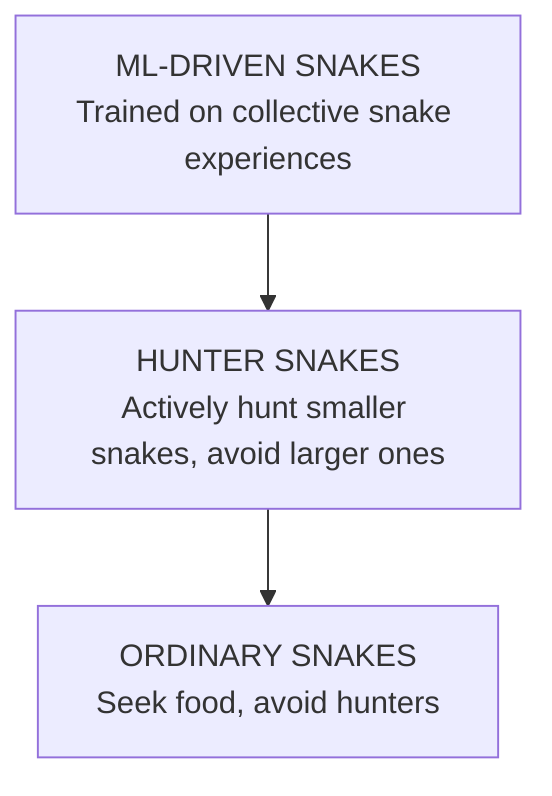

# SNAIKS
```

                      /$$$$$$  /$$$$$$ /$$                
                     /$$__  $$|_  $$_/| $$                
  /$$$$$$$ /$$$$$$$ | $$  \ $$  | $$  | $$   /$$  /$$$$$$$
 /$$_____/| $$__  $$| $$$$$$$$  | $$  | $$  /$$/ /$$_____/
|  $$$$$$ | $$  \ $$| $$__  $$  | $$  | $$$$$$/ |  $$$$$$ 
 \____  $$| $$  | $$| $$  | $$  | $$  | $$_  $$  \____  $$
 /$$$$$$$/| $$  | $$| $$  | $$ /$$$$$$| $$ \  $$ /$$$$$$$/
|_______/ |__/  |__/|__/  |__/|______/|__/  \__/|_______/ 
                                                          
        
```

## Project Overview

**Snaiks** is a Python-based Snake Battle Royale simulation where multiple AI-controlled snakes compete for survival in a shared environment. The project serves as a platform for demonstrating machine learning techniques in a multi-agent system.

The primary goal is to create an environment where AI agents can learn effective survival strategies through reinforcement learning and data collection.

## Learning Objectives

- Demonstrate reinforcement learning in a competitive, multi-agent environment
- Visualize the evolution of AI behavior through gameplay
- Create an ecosystem where strategies emerge organically
- Provide an accessible example of ML applied to classic game mechanics

## How the AI Works

### Input Features
Snakes perceive their environment through these sensory inputs:

| Feature | What Snake "Senses" |
| ------- | ------------------ |
| Current Direction | Where am I heading? (x,y vector) |
| Food Distance/Direction | Where's the nearest snack? |
| Wall Distances | How far to each boundary? |
| Self-Collision Risk | Am I about to eat myself? |
| Hunter Proximity | Is a predator nearby? |
| Size Comparison | Am I bigger than others? |

### Model Structure
Each AI snake uses a Decision Tree Classifier trained on gameplay data to make movement decisions. This model:

- Takes in the above features as inputs
- Outputs a directional decision (UP, DOWN, LEFT, RIGHT)
- Learns from successful snake behaviors
- Balances exploration vs. exploitation of known strategies

## Game Mechanics

### Growth & Evolution

- Snakes start small and primarily seek food
- After consuming 10 food pellets, a snake transforms into a HUNTER (indicated by a red color)
- Hunters can consume smaller snakes for significant growth (gaining 1/3 of the prey's size)
- Growth comes at a cost: larger snakes move more slowly

### Movement System

- Snakes accelerate and decelerate gradually, creating physics-based movement
- Maximum speed decreases as size increases (bigger = slower)
- Turning agility likewise decreases with size

### Intelligence Hierarchy



### Death Conditions

- Wall collision (if walls are set to "destructive")
- Being consumed by a larger hunter snake
- Self-collision is disabled

## Behavioral Evolution

Over time, the AI snakes develop several strategies:

1. **Opportunistic Hunting**: Hunters learn to pursue smaller snakes when nearby but prioritize safety when larger threats approach
2. **Threat Assessment**: Snakes maintain a "fear margin" of 5 size units—avoiding hunters that exceed their size by this threshold
3. **Border Patrol**: Some snakes learn to patrol screen edges where prey may be trapped
4. **Body Targeting**: Hunter snakes learn to intercept prey body segments, not just heads

These behaviors emerge naturally through reinforcement learning as the model is trained on gameplay data.

## Training Mechanics

### Data Collection
Every snake move contributes to a collective learning experience:
```python
# Each move generates a training sample like:
direction_x, direction_y, food_distance_x, food_distance_y, 
wall_distance_up, wall_distance_right, wall_distance_down, wall_distance_left,
self_collision_distance, hunter_distance, hunter_vec_x, hunter_vec_y, action_taken
```

### The Learning Cycle

1. **Play**: Snakes make decisions using either ML model or rule-based logic
2. **Record**: Every decision and outcome is logged
3. **Train**: The model learns from this accumulated data
4. **Improve**: New snakes use the improved model to make better decisions

The model preserves metrics history across training sessions, allowing you to see clear performance improvements over time through accuracy scores and learning curves.

## How to Use

### Prerequisites
```
pygame
numpy
pandas
scikit-learn
matplotlib
```

### Running the Game
```bash
# Start the game to generate training data
python main.py

# Train the AI model with collected data
python train_model.py

# Run the game again to see your trained snakes in action
python main.py
```

## Example Snake Logic

Here's a simplified representation of hunter snake decision-making:

```
IF (is_hunter AND nearby_smaller_snake AND no_larger_threats)
    → Pursue and consume smaller snake
ELSE IF (is_hunter AND nearby_smaller_snake BUT larger_threat_approaching)
    → Evaluate risk vs. reward, possibly flee from larger threat
ELSE IF (hunter_approaching)
    → Flee in direction maximizing distance from hunter
ELSE
    → Seek nearest food
```

## Measuring Progress

You can determine if your snake model is learning effectively by tracking:

- **Survival Time**: Average lifespan of AI snakes
- **Size Growth**: Maximum size achieved before death
- **Hunt Success**: Rate at which hunter snakes catch prey
- **Model Accuracy**: Prediction accuracy improvements
- **Cross-Validation**: Consistency of model learning across different data subsets

Training data is organized in the `/training` directory:
- `/models` - Saved model files
- `/metrics` - Performance statistics 
- `/plots` - Visualization of learning progress

## Known Limitations

- Occasional position errors when snakes wrap around screen edges
- Performance degradation with large numbers of snakes
- Training data quality depends on the diversity of gameplay scenarios
